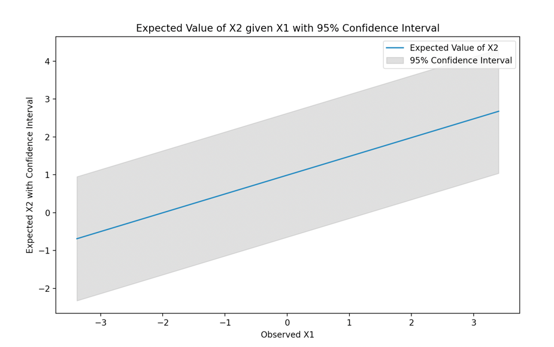

# Problem 1
a. Below are the 4 moments from calculated using the normalized function listed in slide.  
calculate_Mean: 1.0489703904839585
calculate_Variance: 5.427220681881727
calculate_Skewness: 0.8819320922598395
calculate_Kurtosis: 26.122200789989723
b. I choose pandas as the statistical package. Below are the results calculated using pandas.  
pandas_Mean: 1.0489703904839585 
pandas_Variance: 5.427220681881727 
pandas_Skewness: 0.8819320922598395 
pandas_Kurtosis: 23.2442534696162 
c.

# Problem 2
a.
OLS Coefficients: [0.7752741] 
OLS Intercept: -0.08738446427005074  
Standard Deviation of the OLS Error: 1.003756319417732 
Fitted MLE σ (Standard Deviation of the Error): 1.003756319417732 
b.

c.
mean_x1: 0.0010226951490000004 
mean_x2: 0.9902438191000001 
cov_xx: 1.0697746428027168 
cov_yy: 0.9614732933624849 
cov_xy: 0.530684554713422 
x2_conditional_mean = mean_x2 + cov_xy / cov_xx * (x1 - mean_x1) 
                    = 0.99 + 0.53/1.07 * (x1-0.001) 
x2_conditional_variance = 0.6982158881639965 
 
Below is the plotted image for expected value of x2 with 95% confidence interval.  

Below is the plotted image for scattered observed x1 and observed x2.  

# Problem 3
Among all 6 AR and MA models, AR(3) is the best of fit with AIC equals to 1436.66  
Within all MA models, MA(3) is the best of fit with AIC equals to 1536.87, which is slightly larger than the AIC of AR(3).  